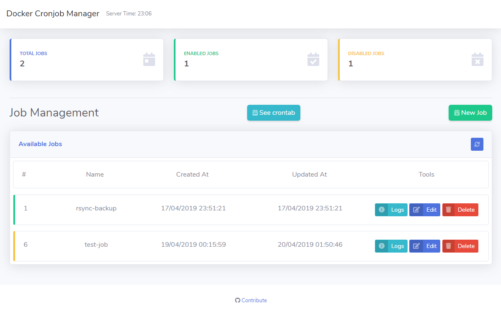

# cronjob-manager




## Whats is cronjob-manager?

The aim for this project is for dockerized environments. Containerized tasks asks for a containerized manager.

## Usage

You will probably want your tasks to persist after container recreation. So create a volume, and pass it as a mountpoint.

```sh
docker volume create cronmanager-data
```

You will also want the job manager to access your other containers, so it can manage them. For that, pass `/var/run/docker.sock` as a mountpoint.

This is a cronjob schedule related image, which is very time sensitive. So it is very important to get the your time settings right. Luckily this image supports the `TZ` environment var for setting the timezone, so no worries. Just make sure to get it right like in the example below.

The container exposes port `80` for using the web interface and the API, just forward that port to a port on your host. The web interface is located at `http://your.hostname:port/`. The API docs are below.

Now to run the image:

```sh
docker run \
-p 80:80 \
-v cronmanager-data:/usr/src/app/.node-persist \
-v /var/run/docker.sock:/var/run/docker.sock \
-e TZ="America/Sao_Paulo" \
edmur/cronjob-manager
```

## API

The web interface uses a REST API on the back-end that can also be called externally.

- `GET` Information<br/>
Retrieve information about crontab.
```
http://your-host/api/info
```

- `GET` Jobs<br/>
Retrieve a list of existing jobs.
```
http://your-host/api/jobs
```

- `GET` Job<br/>
Retrieve information about specific Job.
```
http://your-host/api/jobs/{id}
```

- `GET` Job Logs<br/>
Retrieve logs from specific Job.
```
http://your-host/api/jobs/{id}/logs
```

- `DELETE` Job<br/>
Delete a Job.
```
http://your-host/api/jobs/{id}
```

- `POST` Jobs<br/>
Create a new Job.
```
http://your-host/api/jobs
```
### Headers
|     Field    |  Type  |       Value      |
|:------------:|:------:|:----------------:|
| Content-Type | String | application/json |
### Body
|    Field    |   Type  |                Description               |
|:-----------:|:-------:|:----------------------------------------:|
| name        | String  | A custom name for your Job.              |
| cron        | String  | The cron schedule expression.            |
| command     | String  | The name of the container to run.        |
| commandType | String  | The command to execute on the container. |
| active      | Boolean | If the job is enabled or not.            |

- `PUT` Jobs<br/>
Update information of existing job.
```
http://your-host/api/jobs/{id}
```
### Headers
|     Field    |  Type  |       Value      |
|:------------:|:------:|:----------------:|
| Content-Type | String | application/json |
### Body
|    Field    |   Type  |                Description               |
|:-----------:|:-------:|:----------------------------------------:|
| name        | String  | A custom name for your Job.              |
| cron        | String  | The cron schedule expression.            |
| command     | String  | The name of the container to run.        |
| commandType | String  | The command to execute on the container. |
| active      | Boolean | If the job is enabled or not.            |

## To Do
- Add current container time to web interface

## License

This project is open-source software licensed under the [MIT license](https://opensource.org/licenses/MIT).
